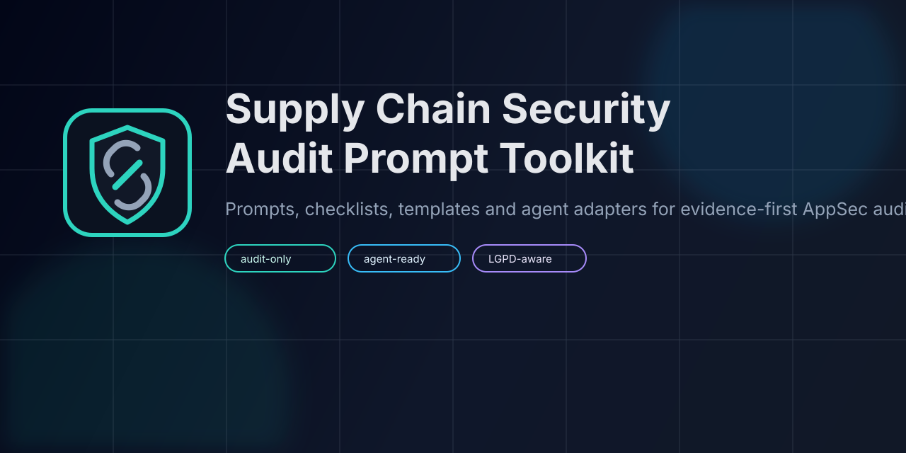

# Supply Chain Security Audit Prompt Toolkit

[](LICENSE)
[](SECURITY.md)
[](https://github.com/leoziondev/ai-supply-chain-audit/actions/workflows/validate-markdown.yml)
[](DISTRIBUTION.md)
[](skills/supply-chain-audit/references/no-project-mutation.md)
[](checklists/data-breach-lgpd.md)

Toolkit em portugues para equipes de DevSecOps e AppSec conduzirem auditorias assistidas por LLM em projetos modernos com foco em cadeia de suprimentos, malware em dependencias, npm, Composer/Laravel, CI/CD, frameworks full-stack JavaScript, plataformas de deploy, containers, vazamento de dados e resposta a incidentes LGPD.

Toolkit open source de prompts, checklists, templates, skill global e adapters para auditoria de seguranca de supply chain em npm, Composer, Laravel, Node.js, GitHub Actions, Next.js, Vercel, TanStack, containers, SaaS/OAuth e resposta a incidentes LGPD.

O objetivo e transformar arquivos reais de um projeto em uma analise tecnica, defensiva e acionavel. O prompt principal nao substitui scanners, pentest ou resposta a incidente, mas ajuda a organizar investigacao, evidencias, hipoteses, IOCs e remediacoes.

Este repo e a fonte do toolkit. Nao clone nem copie este repo para dentro do projeto auditado por padrao. Para uso recorrente, instale a skill global ou use os adapters de agente descritos em `DISTRIBUTION.md`.

## Links rapidos

- Prompt principal: `prompts/supply-chain-security-audit.md`
- Distribuicao e agentes: `DISTRIBUTION.md`
- Skill global: `skills/supply-chain-audit/SKILL.md`
- Checklists: `checklists/`
- Exemplos: `examples/`
- Templates: `templates/`
- Branding: `BRAND.md`
- Release checklist: `docs/release-checklist.md`

## Por que este toolkit existe

Auditorias modernas nao podem depender apenas de CVEs. Ataques recentes exploram maintainers, lockfiles, lifecycle hooks, CI/CD, OIDC, SaaS/OAuth, deploy platforms, dados pessoais e terceiros. Este toolkit organiza um workflow evidence-first para agentes e humanos revisarem esses riscos sem poluir o projeto auditado.

## Instalacao recomendada

Para uso recorrente, instale a skill globalmente no agente em vez de copiar este repo para projetos auditados.

```text
~/.codex/skills/supply-chain-audit/
```

Para outros agentes, use os templates em `adapters/`:

- Codex: `adapters/codex/AGENTS.md`
- Claude Code: `adapters/claude-code/CLAUDE.md`
- Cursor: `adapters/cursor/supply-chain-audit.mdc`
- OpenCode: `adapters/opencode/AGENTS.md` ou `adapters/opencode/supply-chain-audit-agent.md`

Arquivos por projeto sao opcionais e devem ser usados apenas quando a equipe quiser versionar instrucoes naquele repo.

## Quando usar

Use este toolkit quando precisar revisar:

- Dependencias npm, pnpm, Yarn, Composer ou Packagist.
- Lockfiles criados ou atualizados durante uma janela suspeita.
- Pacotes com scripts `preinstall`, `install`, `postinstall` ou autoloaders.
- Pipelines GitHub Actions, GitLab CI, Jenkins, Azure DevOps ou Bitbucket.
- Build runners com acesso a secrets, cloud credentials, registry tokens ou deploy keys.
- Dockerfiles, imagens, SBOMs, artifacts e releases.
- Aplicacoes Laravel/PHP, Node.js, Next.js ou TanStack Start que possam ter sido afetadas por pacotes comprometidos, falhas de framework, CI/CD inseguro ou incidentes de plataforma.
- Projetos hospedados em Vercel com necessidade de revisar env vars, deployments, activity logs, integrations e OAuth apps.
- Marketplaces, apps de delivery, e-commerce e plataformas com dados pessoais em larga escala sob suspeita de vazamento, extorsao ou uso indevido por terceiros.

## Ameacas cobertas

O prompt foi desenhado para considerar ataques recentes e padroes atuais, incluindo:

- Typosquatting npm com roubo de credenciais cloud e CI/CD.
- Comprometimento de contas de maintainers e publicacao de versoes maliciosas.
- Lifecycle hooks de npm executando payloads durante instalacao.
- Dependencias ocultas usadas para instalar RATs ou infostealers.
- Pacotes Packagist/Composer maliciosos mirando Laravel.
- `composer.lock` e lockfiles como fonte de evidencia.
- `autoload.files`, service providers e scripts de build como pontos de execucao.
- Artifact poisoning, workflow poisoning, cache poisoning e actions nao fixadas.
- Exfiltracao de AWS, Vault, GitHub, npm, Composer e secrets de aplicacao.
- Bypass de autorizacao em middleware, Server Functions/RSC e rewrites em frameworks full-stack.
- Incidentes de SaaS/OAuth que exponham env vars, deployments ou contas de plataforma.
- Incidentes alegados de vazamento de dados, extorsao, dumps em threat intelligence, abuso de APIs, data lake exposure, CRM/support exposure e risco LGPD.

## Casos recentes cobertos

- Vercel April 2026 incident: risco de SaaS/OAuth, Google Workspace, contas Vercel, activity logs, env vars e deployments suspeitos. O caso nao deve ser descrito como pacote npm da Vercel comprometido sem evidencia, pois o boletim publico afirma que nao havia evidencia de tampering nos pacotes publicados.
- Next.js CVE-2025-29927: bypass de autorizacao quando a aplicacao depende de middleware para auth, especialmente em apps self-hosted ou sem mitigacao na borda.
- Next.js request smuggling em rewrites: risco em rotas que fazem proxy para backends externos, exigindo auth no backend e bloqueio de metodos/headers perigosos quando nao for possivel atualizar.
- React Server Components CVE-2025-55182: risco critico em pacotes `react-server-dom-*` e frameworks/bundlers que expõem Server Functions ou RSC vulneraveis.
- TanStack May 2026 advisory: malware em 42 pacotes `@tanstack/*`, publicado por cadeia envolvendo `pull_request_target`, cache poisoning, OIDC trusted publisher e extracao de tokens do runner.
- GitHub Actions Pwn Requests: PRs nao confiaveis, cache/artifact poisoning, tokens com permissao excessiva e trusted publishing mal delimitado.
- Incidentes alegados em marketplaces/delivery, como reports publicos de extorsao de dados em larga escala, devem ser usados como motivador de threat model ate haver evidencia validada. Nao afirme comprometimento sem confirmacao oficial, amostra verificada ou evidencia interna.

## Incidentes alegados de vazamento de dados

Quando surgir uma alegacao publica de vazamento, venda ou extorsao de dados, o toolkit deve ajudar a classificar a confianca da evidencia antes de recomendar a resposta:

- `alegacao`: report de threat intel, forum, rede social ou noticia sem amostra validada.
- `amostra verificada`: amostra sanitizada conferida contra sistemas internos, sem redistribuir dados pessoais.
- `confirmacao interna`: logs, registros ou trilha tecnica confirmam acesso, copia, exportacao ou exfiltracao.
- `confirmacao oficial`: comunicado publico, notificacao regulatoria ou decisao formal do controlador.
- `incidente descartado`: investigacao mostra dataset falso, reciclado, enriquecido de outra fonte ou sem relacao com a organizacao.

Esse tipo de caso contribui para supply chain quando envolve terceiros, operadores/processadores de dados, SaaS, CRM, suporte, BI, data lake, integracoes, APIs, CI/CD, credenciais, parceiros comerciais ou fornecedores com acesso a dados pessoais.

Referencias publicas:

- Microsoft: https://www.microsoft.com/en-us/security/blog/2026/05/28/typosquatted-npm-packages-used-steal-cloud-ci-cd-secrets/
- StepSecurity: https://www.stepsecurity.io/blog/20-popular-npm-packages-compromised-chalk-debug-strip-ansi-color-convert-wrap-ansi
- SANS: https://www.sans.org/blog/axios-npm-supply-chain-compromise-malicious-packages-remote-access-trojan
- Secured Intel: https://www.securedintel.com/blog/malicious-packagist-packages-deploying-cross-platform-rats-in-laravel-ecosystems
- Vercel April 2026 incident: https://vercel.com/kb/bulletin/vercel-april-2026-security-incident
- Next.js CVE-2025-29927: https://github.com/advisories/GHSA-f82v-jwr5-mffw
- Next.js request smuggling: https://github.com/vercel/next.js/security/advisories/GHSA-ggv3-7p47-pfv8
- React Server Components CVE-2025-55182: https://react.dev/blog/2025/12/03/critical-security-vulnerability-in-react-server-components
- TanStack advisory: https://github.com/TanStack/router/security/advisories/GHSA-g7cv-rxg3-hmpx
- GitHub Security Lab Pwn Requests: https://securitylab.github.com/resources/github-actions-preventing-pwn-requests/
- npm trusted publishing: https://docs.npmjs.com/trusted-publishers/

## Estrutura

```text
.
+-- .github/
|   +-- ISSUE_TEMPLATE/
|   +-- workflows/
+-- adapters/
|   +-- claude-code/
|   +-- codex/
|   +-- cursor/
|   +-- opencode/
+-- assets/
+-- checklists/
|   +-- cicd.md
|   +-- composer.md
|   +-- container.md
|   +-- data-breach-lgpd.md
|   +-- github.md
|   +-- marketplace-ecommerce.md
|   +-- nextjs.md
|   +-- npm.md
|   +-- tanstack-start.md
|   +-- vercel.md
+-- examples/
|   +-- cicd-example.md
|   +-- github-actions-cache-poisoning-example.md
|   +-- laravel-example.md
|   +-- marketplace-data-extortion-example.md
|   +-- nextjs-vercel-example.md
|   +-- nodejs-example.md
|   +-- tanstack-supply-chain-example.md
|   +-- vercel-incident-response-example.md
+-- prompts/
|   +-- supply-chain-security-audit.md
+-- references/
|   +-- agent-usage-matrix.md
+-- skills/
|   +-- supply-chain-audit/
+-- scripts/
+-- templates/
|   +-- audit-report.md
|   +-- incident-response.md
+-- BRAND.md
+-- CHANGELOG.md
+-- CONTRIBUTING.md
+-- DISTRIBUTION.md
+-- LICENSE
+-- README.md
+-- SECURITY.md
```

## Como usar

1. Abra o prompt principal em `prompts/supply-chain-security-audit.md`.
2. Cole o prompt no LLM autorizado pela sua organizacao.
3. Anexe ou cole os arquivos relevantes do projeto auditado.
4. Exija que a resposta use o formato obrigatorio do prompt: resumo executivo, inventario, findings priorizados, tabela de evidencias, plano de mitigacao e arquivos ausentes.
5. Valide manualmente os achados com ferramentas reais de SAST, SCA, logs, EDR, SIEM, registry metadata, plataforma de deploy e revisao humana.

## Como usar com agentes

Modo recomendado:

- Codex: instale `skills/supply-chain-audit/` como skill global em `~/.codex/skills/supply-chain-audit/`.
- Claude Code: use `adapters/claude-code/CLAUDE.md` como memoria global/user; use no projeto apenas se a equipe quiser versionar essa regra.
- Cursor: use User Rules globais; use `adapters/cursor/supply-chain-audit.mdc` como Project Rule apenas em repositorios que querem essa regra versionada.
- OpenCode: use `adapters/opencode/AGENTS.md` em configuracao global ou `adapters/opencode/supply-chain-audit-agent.md` como agent audit-only.

Regra comum:

- O agente deve ler o projeto auditado sem criar arquivos por padrao.
- O agente nao deve rodar installs, builds, migrations ou deploys antes da triagem.
- O agente nao deve baixar dumps, dados pessoais reais ou material de foruns criminosos.
- O agente deve classificar evidencia antes de afirmar incidente, vazamento ou comprometimento.

Veja `DISTRIBUTION.md` e `references/agent-usage-matrix.md` para detalhes de distribuicao.

## Arquivos recomendados por stack

### Node.js / npm

```text
package.json
package-lock.json
pnpm-lock.yaml
yarn.lock
npm-shrinkwrap.json
.npmrc
.yarnrc.yml
Dockerfile
docker-compose.yml
.github/workflows/*
src/*
```

### Next.js / Vercel

```text
package.json
package-lock.json
pnpm-lock.yaml
next.config.js
middleware.ts
app/**/*
pages/**/*
src/**/*
vercel.json
.vercel/project.json
.github/workflows/*
Vercel activity logs
recent deployment list
environment variable inventory
integration and OAuth app inventory
```

### TanStack Start / Router

```text
package.json
package-lock.json
pnpm-lock.yaml
yarn.lock
src/routes/**/*
src/start.ts
vite.config.ts
.github/workflows/*
npm install logs around 2026-05-11 19:20-19:26 UTC, if relevant
```

### Laravel / PHP / Composer

```text
composer.json
composer.lock
package.json
package-lock.json
.env.example
config/*
app/Providers/*
app/Console/*
app/Jobs/*
routes/*
Dockerfile
.github/workflows/*
```

### CI/CD e infraestrutura

```text
.github/workflows/*
.gitlab-ci.yml
Jenkinsfile
azure-pipelines.yml
CODEOWNERS
Dockerfile
docker-compose.yml
helm/*
k8s/*
terraform/*
scripts/*
```

### Marketplace / e-commerce / LGPD

```text
data inventory
data flow diagram
API gateway logs
application logs
WAF/CDN logs
CRM/support audit logs
BI/data lake audit logs
payment provider integration docs
processor/subprocessor inventory
incident timeline
sanitized sample verification notes
ANPD communication draft, if applicable
```

## Workflow recomendado

1. Inventariar linguagens, package managers, frameworks, deploy platforms, lockfiles, CI/CD, containers, dados pessoais, operadores/processadores, secrets e trust boundaries.
2. Revisar arquivos de dependencias e scripts de instalacao antes de executar qualquer build.
3. Procurar hooks, autoloaders, downloaders remotos, payloads ofuscados, chamadas de shell e dependencias git.
4. Conferir lockfiles contra advisories, versoes yanked, pacotes removidos e mudancas de maintainer.
5. Revisar GitHub Actions e outros CI/CDs para permissoes excessivas, PRs nao confiaveis, cache/artifact poisoning, OIDC e trusted publishing.
6. Revisar Next.js, Vercel e TanStack Start para fronteiras client/server, middleware auth, env vars, deployments e Server Functions.
7. Classificar alegacoes de vazamento por nivel de evidencia antes de declarar incidente confirmado.
8. Gerar findings com evidencia verificavel e plano de mitigacao por prioridade.
9. Em caso de comprometimento provavel, preservar evidencias e acionar resposta a incidente, DPO/juridico e avaliacao ANPD/titulares.

## Artefatos incluidos

- Prompt principal: `prompts/supply-chain-security-audit.md`.
- Exemplos por cenario: `examples/`.
- Checklists operacionais: `checklists/`.
- Modelo de relatorio: `templates/audit-report.md`.
- Modelo de resposta a incidente: `templates/incident-response.md`.

## Limites

Este toolkit nao substitui:

- Pentest profissional.
- SAST, DAST, SCA, EDR, XDR ou SIEM.
- Analise humana especializada.
- Validacao em registry, logs, endpoint, identity provider, deploy platform e cloud.
- Processo formal de resposta a incidente.

LLMs podem errar, omitir contexto ou inferir incorretamente. Trate toda conclusao como hipotese ate haver evidencia tecnica.

## Uso autorizado

Use este material apenas para defesa, auditoria autorizada, pesquisa, hardening, resposta a incidente e educacao. Nao use o conteudo para invadir sistemas, distribuir malware, roubar credenciais ou burlar controles.

## Contribuicoes

Contribuicoes sao bem-vindas. Veja `CONTRIBUTING.md` antes de abrir PRs com novos cenarios, checklists, exemplos ou melhorias no prompt.

## Licenca

MIT. Veja `LICENSE`.
